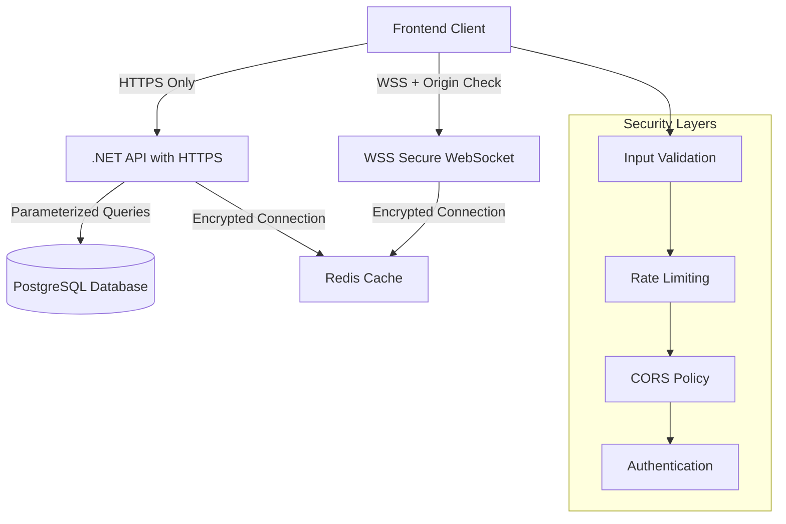
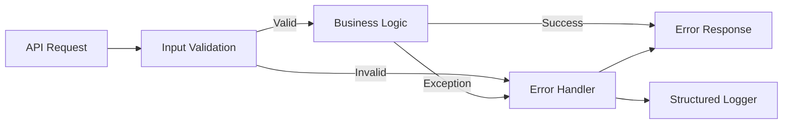

# Design Document

## Overview

This design document outlines the architectural approach to address security vulnerabilities, improve error handling, implement input validation, and optimize performance across the Stock Tracker application. The improvements will be implemented incrementally across the frontend (React/TypeScript), backend (.NET/C#), and WebSocket server (Node.js).

The design follows defense-in-depth principles, implementing security at multiple layers while maintaining backward compatibility and minimizing disruption to existing functionality.

## Architecture

### Security Architecture



### Error Handling Flow



## Components and Interfaces

### 1. Backend Security Components

#### 1.1 Global Exception Handler Middleware

**Purpose:** Centralize error handling and provide consistent error responses

**Implementation:**
```csharp
public class GlobalExceptionHandlerMiddleware
{
    private readonly RequestDelegate _next;
    private readonly ILogger<GlobalExceptionHandlerMiddleware> _logger;
    
    public async Task InvokeAsync(HttpContext context)
    {
        try
        {
            await _next(context);
        }
        catch (ValidationException ex)
        {
            await HandleValidationException(context, ex);
        }
        catch (NotFoundException ex)
        {
            await HandleNotFoundException(context, ex);
        }
        catch (Exception ex)
        {
            await HandleGenericException(context, ex);
        }
    }
}
```

**Features:**
- Catches all unhandled exceptions
- Maps exceptions to appropriate HTTP status codes
- Logs detailed error information with context
- Returns user-friendly error messages
- Hides sensitive information in production

#### 1.2 Input Validation Middleware

**Purpose:** Validate and sanitize all incoming requests

**Implementation:**
```csharp
public class InputValidationMiddleware
{
    // Validates request body, query parameters, and route parameters
    // Uses FluentValidation for complex validation rules
    // Sanitizes string inputs to prevent injection attacks
}
```

**Validation Rules:**
- Stock symbols: Alphanumeric, 1-10 characters
- Prices: Positive decimal numbers
- Quantities: Positive integers
- User IDs: Valid GUID format
- Dates: Valid ISO 8601 format

#### 1.3 CORS Configuration Service

**Purpose:** Manage CORS policies securely

**Implementation:**
```csharp
public static class CorsConfiguration
{
    public static void ConfigureSecureCors(this IServiceCollection services, IConfiguration config)
    {
        var allowedOrigins = config.GetSection("Cors:AllowedOrigins").Get<string[]>();
        
        services.AddCors(options =>
        {
            options.AddPolicy("SecurePolicy", policy =>
            {
                policy.WithOrigins(allowedOrigins)
                      .AllowAnyMethod()
                      .AllowAnyHeader()
                      .AllowCredentials()
                      .SetIsOriginAllowedToAllowWildcardSubdomains();
            });
        });
    }
}
```

**Configuration:**
- Development: localhost origins
- Staging: staging domain
- Production: production domain only

#### 1.4 Rate Limiting Service

**Purpose:** Protect API from abuse and excessive usage

**Implementation:**
```csharp
public class RateLimitingService
{
    // Uses AspNetCoreRateLimit library
    // Configurable limits per endpoint
    // Different limits for authenticated vs anonymous users
    // Redis-backed for distributed scenarios
}
```

**Rate Limits:**
- Anonymous users: 100 requests/minute
- Authenticated users: 500 requests/minute
- WebSocket connections: 10 per IP
- Specific endpoints may have stricter limits

### 2. Frontend Validation Components

#### 2.1 Form Validation Hook

**Purpose:** Provide reusable form validation logic

**Implementation:**
```typescript
export function useFormValidation<T>(
  initialValues: T,
  validationSchema: ValidationSchema<T>
) {
  const [values, setValues] = useState<T>(initialValues);
  const [errors, setErrors] = useState<Partial<Record<keyof T, string>>>({});
  const [touched, setTouched] = useState<Partial<Record<keyof T, boolean>>>({});
  
  const validate = (field?: keyof T) => {
    // Validation logic
  };
  
  const handleChange = (field: keyof T, value: any) => {
    setValues(prev => ({ ...prev, [field]: value }));
    if (touched[field]) {
      validate(field);
    }
  };
  
  const handleBlur = (field: keyof T) => {
    setTouched(prev => ({ ...prev, [field]: true }));
    validate(field);
  };
  
  return { values, errors, touched, handleChange, handleBlur, validate };
}
```

#### 2.2 Validation Schemas

**Purpose:** Define validation rules for forms

**Implementation:**
```typescript
export const alertValidationSchema = {
  targetPrice: (value: string) => {
    const num = parseFloat(value);
    if (isNaN(num)) return 'Must be a valid number';
    if (num <= 0) return 'Must be greater than 0';
    if (num > 1000000) return 'Price too high';
    return null;
  },
  targetPercent: (value: string) => {
    const num = parseFloat(value);
    if (isNaN(num)) return 'Must be a valid number';
    if (num <= 0) return 'Must be greater than 0';
    if (num > 100) return 'Cannot exceed 100%';
    return null;
  }
};

export const portfolioValidationSchema = {
  quantity: (value: string) => {
    const num = parseInt(value);
    if (isNaN(num)) return 'Must be a valid number';
    if (num <= 0) return 'Must be at least 1';
    if (num > 1000000) return 'Quantity too high';
    return null;
  },
  price: (value: string) => {
    const num = parseFloat(value);
    if (isNaN(num)) return 'Must be a valid number';
    if (num <= 0) return 'Must be greater than 0';
    if (num > 1000000) return 'Price too high';
    return null;
  }
};
```

#### 2.3 Enhanced Error Display Component

**Purpose:** Display user-friendly error messages

**Implementation:**
```typescript
export function ErrorMessage({ error, field }: ErrorMessageProps) {
  if (!error) return null;
  
  return (
    <p className="text-sm text-destructive mt-1 flex items-center gap-1">
      <AlertCircle className="h-3 w-3" />
      {error}
    </p>
  );
}
```

### 3. WebSocket Security Components

#### 3.1 Secure WebSocket Server

**Purpose:** Implement WSS with origin validation

**Implementation:**
```javascript
const https = require('https');
const fs = require('fs');
const WebSocket = require('ws');

// Load SSL certificates
const server = https.createServer({
  cert: fs.readFileSync(process.env.SSL_CERT_PATH),
  key: fs.readFileSync(process.env.SSL_KEY_PATH)
});

const wss = new WebSocket.Server({ 
  server,
  verifyClient: (info, callback) => {
    const origin = info.origin || info.req.headers.origin;
    const allowedOrigins = process.env.ALLOWED_ORIGINS.split(',');
    
    if (allowedOrigins.includes(origin)) {
      callback(true);
    } else {
      console.warn(`Rejected connection from unauthorized origin: ${origin}`);
      callback(false, 403, 'Forbidden');
    }
  }
});
```

**Features:**
- Uses HTTPS server for WSS
- Validates origin header
- Rejects unauthorized connections
- Logs security events

#### 3.2 Connection Rate Limiter

**Purpose:** Prevent connection flooding

**Implementation:**
```javascript
class ConnectionRateLimiter {
  constructor(maxConnections = 10, windowMs = 60000) {
    this.connections = new Map(); // IP -> [timestamps]
    this.maxConnections = maxConnections;
    this.windowMs = windowMs;
  }
  
  canConnect(ip) {
    const now = Date.now();
    const timestamps = this.connections.get(ip) || [];
    
    // Remove old timestamps
    const recentTimestamps = timestamps.filter(t => now - t < this.windowMs);
    
    if (recentTimestamps.length >= this.maxConnections) {
      return false;
    }
    
    recentTimestamps.push(now);
    this.connections.set(ip, recentTimestamps);
    return true;
  }
}
```

### 4. Data Fetching Optimization

#### 4.1 React Query Integration

**Purpose:** Centralize data fetching with caching and deduplication

**Implementation:**
```typescript
// Setup React Query
const queryClient = new QueryClient({
  defaultOptions: {
    queries: {
      staleTime: 30000, // 30 seconds
      cacheTime: 300000, // 5 minutes
      retry: 3,
      retryDelay: (attemptIndex) => Math.min(1000 * 2 ** attemptIndex, 30000),
      refetchOnWindowFocus: false
    }
  }
});

// Custom hooks using React Query
export function useStockQuote(symbol: string) {
  return useQuery({
    queryKey: ['stock', symbol],
    queryFn: () => fetchStockQuote(symbol),
    enabled: !!symbol
  });
}

export function useMultipleQuotes(symbols: string[]) {
  return useQuery({
    queryKey: ['stocks', symbols.sort().join(',')],
    queryFn: () => fetchMultipleQuotes(symbols),
    enabled: symbols.length > 0
  });
}
```

**Benefits:**
- Automatic caching
- Request deduplication
- Background refetching
- Optimistic updates
- Error retry with exponential backoff

#### 4.2 Batch Request Coordinator

**Purpose:** Combine multiple requests into batches

**Implementation:**
```typescript
class BatchRequestCoordinator {
  private queue: Set<string> = new Set();
  private timer: NodeJS.Timeout | null = null;
  private readonly batchDelay = 50; // ms
  
  request(symbol: string): Promise<StockQuote> {
    this.queue.add(symbol);
    
    return new Promise((resolve, reject) => {
      if (this.timer) clearTimeout(this.timer);
      
      this.timer = setTimeout(() => {
        this.flush().then(results => {
          resolve(results[symbol]);
        }).catch(reject);
      }, this.batchDelay);
    });
  }
  
  private async flush() {
    const symbols = Array.from(this.queue);
    this.queue.clear();
    
    const results = await fetchMultipleQuotes(symbols);
    return results.reduce((acc, quote) => {
      acc[quote.symbol] = quote;
      return acc;
    }, {} as Record<string, StockQuote>);
  }
}
```

### 5. Database Seeding Optimization

#### 5.1 Batch Insert Service

**Purpose:** Insert data in manageable batches

**Implementation:**
```typescript
export async function seedStocksInBatches(
  stocks: Stock[],
  batchSize: number = 50
): Promise<SeedResult> {
  const results = {
    successful: 0,
    failed: 0,
    errors: [] as string[]
  };
  
  for (let i = 0; i < stocks.length; i += batchSize) {
    const batch = stocks.slice(i, i + batchSize);
    
    try {
      const { data, error } = await supabase
        .from('stocks')
        .upsert(batch, { onConflict: 'symbol' });
      
      if (error) throw error;
      
      results.successful += batch.length;
      console.log(`Inserted batch ${i / batchSize + 1}: ${batch.length} stocks`);
      
      // Small delay to avoid overwhelming the database
      await new Promise(resolve => setTimeout(resolve, 100));
    } catch (error) {
      results.failed += batch.length;
      results.errors.push(`Batch ${i / batchSize + 1}: ${error.message}`);
      console.error(`Failed to insert batch ${i / batchSize + 1}:`, error);
    }
  }
  
  return results;
}
```

## Data Models

### Error Response Model

```typescript
interface ErrorResponse {
  success: false;
  error: string;
  errorCode?: string;
  details?: Record<string, string[]>; // Validation errors
  timestamp: string;
  requestId?: string;
}
```

### Validation Error Model

```typescript
interface ValidationError {
  field: string;
  message: string;
  value?: any;
}
```

### Rate Limit Response Headers

```
X-RateLimit-Limit: 100
X-RateLimit-Remaining: 95
X-RateLimit-Reset: 1640000000
Retry-After: 60
```

## Error Handling

### Backend Error Handling Strategy

**Exception Hierarchy:**
```
Exception
├── ValidationException (400)
├── NotFoundException (404)
├── UnauthorizedException (401)
├── ForbiddenException (403)
├── ConflictException (409)
├── RateLimitException (429)
└── InternalServerException (500)
```

**Error Response Format:**
```json
{
  "success": false,
  "error": "User-friendly error message",
  "errorCode": "VALIDATION_ERROR",
  "details": {
    "targetPrice": ["Must be greater than 0"],
    "quantity": ["Must be a positive integer"]
  },
  "timestamp": "2025-06-10T12:00:00Z",
  "requestId": "abc123"
}
```

### Frontend Error Handling Strategy

**Error Display Levels:**
1. **Inline Validation:** Real-time field-level errors
2. **Form-level Errors:** Summary of validation errors
3. **Toast Notifications:** API errors and success messages
4. **Error Boundary:** Catastrophic errors with fallback UI

**Retry Strategy:**
```typescript
async function fetchWithRetry<T>(
  fn: () => Promise<T>,
  maxRetries: number = 3
): Promise<T> {
  let lastError: Error;
  
  for (let i = 0; i < maxRetries; i++) {
    try {
      return await fn();
    } catch (error) {
      lastError = error;
      
      // Don't retry on client errors (4xx)
      if (error.status >= 400 && error.status < 500) {
        throw error;
      }
      
      // Exponential backoff
      const delay = Math.min(1000 * 2 ** i, 10000);
      await new Promise(resolve => setTimeout(resolve, delay));
    }
  }
  
  throw lastError;
}
```

### WebSocket Error Handling

**Connection Resilience:**
```javascript
class ResilientWebSocket {
  constructor(url, options = {}) {
    this.url = url;
    this.reconnectAttempts = 0;
    this.maxReconnectAttempts = options.maxReconnectAttempts || 10;
    this.reconnectDelay = options.reconnectDelay || 1000;
    this.subscriptions = new Set();
  }
  
  connect() {
    this.ws = new WebSocket(this.url);
    
    this.ws.onopen = () => {
      console.log('WebSocket connected');
      this.reconnectAttempts = 0;
      this.resubscribe();
    };
    
    this.ws.onclose = () => {
      console.log('WebSocket closed');
      this.reconnect();
    };
    
    this.ws.onerror = (error) => {
      console.error('WebSocket error:', error);
    };
  }
  
  reconnect() {
    if (this.reconnectAttempts >= this.maxReconnectAttempts) {
      console.error('Max reconnection attempts reached');
      return;
    }
    
    const delay = this.reconnectDelay * Math.pow(2, this.reconnectAttempts);
    this.reconnectAttempts++;
    
    setTimeout(() => {
      console.log(`Reconnecting... (attempt ${this.reconnectAttempts})`);
      this.connect();
    }, delay);
  }
  
  resubscribe() {
    this.subscriptions.forEach(symbol => {
      this.subscribe(symbol);
    });
  }
}
```

## Testing Strategy

### Unit Tests

**Backend:**
- Validation middleware tests
- Exception handler tests
- Rate limiting tests
- CORS configuration tests

**Frontend:**
- Form validation hook tests
- Error display component tests
- Retry logic tests

### Integration Tests

**Backend:**
- API endpoint security tests
- Database query parameterization tests
- Rate limiting integration tests

**WebSocket:**
- Origin validation tests
- Connection limit tests
- Reconnection tests

### Security Tests

- SQL injection prevention tests
- XSS prevention tests
- CSRF protection tests
- Rate limiting bypass tests
- Origin validation bypass tests

## Configuration Management

### Environment Variables

**Backend (.NET):**
```json
{
  "Cors": {
    "AllowedOrigins": ["https://app.example.com"]
  },
  "RateLimit": {
    "EnableRateLimiting": true,
    "PerMinute": 100
  },
  "Security": {
    "RequireHttps": true,
    "EnableHSTS": true
  }
}
```

**WebSocket Server (Node.js):**
```env
WS_PORT=8081
SSL_CERT_PATH=/path/to/cert.pem
SSL_KEY_PATH=/path/to/key.pem
ALLOWED_ORIGINS=https://app.example.com,https://www.example.com
MAX_CONNECTIONS_PER_IP=10
```

**Frontend (React):**
```env
VITE_API_URL=https://api.example.com
VITE_WS_URL=wss://ws.example.com
VITE_ENABLE_DEBUG=false
```

### Configuration Validation

**Startup Validation:**
```csharp
public static class ConfigurationValidator
{
    public static void ValidateConfiguration(IConfiguration config)
    {
        var requiredSettings = new[]
        {
            "ConnectionStrings:DefaultConnection",
            "ConnectionStrings:Redis",
            "Cors:AllowedOrigins"
        };
        
        foreach (var setting in requiredSettings)
        {
            if (string.IsNullOrEmpty(config[setting]))
            {
                throw new InvalidOperationException(
                    $"Required configuration '{setting}' is missing");
            }
        }
    }
}
```

## Deployment Considerations

### SSL/TLS Certificates

**Development:**
- Self-signed certificates for local testing
- mkcert for trusted local certificates

**Production:**
- Let's Encrypt for free certificates
- Automatic renewal setup
- Certificate monitoring

### Monitoring and Logging

**Structured Logging:**
```csharp
_logger.LogError(
    "API request failed: {Method} {Path} - {StatusCode} - {ErrorMessage}",
    context.Request.Method,
    context.Request.Path,
    statusCode,
    errorMessage
);
```

**Metrics to Track:**
- Request rate per endpoint
- Error rate by type
- Response time percentiles
- WebSocket connection count
- Rate limit hits
- Failed authentication attempts

### Health Checks

**Backend Health Check:**
```csharp
builder.Services.AddHealthChecks()
    .AddNpgSql(connectionString)
    .AddRedis(redisConnection)
    .AddCheck<ApiHealthCheck>("api");
```

**WebSocket Health Check:**
```javascript
app.get('/health', (req, res) => {
  res.json({
    status: 'healthy',
    connections: wss.clients.size,
    redis: redisClient.status === 'ready',
    uptime: process.uptime()
  });
});
```

## Performance Optimizations

### Caching Strategy

**Multi-Level Caching:**
1. **Browser Cache:** Static assets (1 year)
2. **React Query Cache:** API responses (30 seconds - 5 minutes)
3. **Redis Cache:** Backend data (1-10 minutes)
4. **Database Query Cache:** Expensive queries (5-15 minutes)

### Connection Pooling

**Database:**
```csharp
options.UseNpgsql(connectionString, npgsqlOptions =>
{
    npgsqlOptions.MaxBatchSize(100);
    npgsqlOptions.CommandTimeout(30);
});
```

**Redis:**
```csharp
services.AddStackExchangeRedisCache(options =>
{
    options.Configuration = redisConnection;
    options.InstanceName = "StockTracker_";
    options.ConfigurationOptions = new ConfigurationOptions
    {
        ConnectTimeout = 5000,
        SyncTimeout = 5000,
        AbortOnConnectFail = false
    };
});
```

## Migration Strategy

### Phase 1: Backend Security (Week 1)
- Implement global exception handler
- Add input validation middleware
- Configure secure CORS
- Add rate limiting

### Phase 2: Frontend Validation (Week 1)
- Create validation hooks
- Update CreateAlertDialog
- Update AddToPortfolioDialog
- Add error display components

### Phase 3: WebSocket Security (Week 2)
- Implement WSS
- Add origin validation
- Add connection rate limiting
- Update frontend to use WSS

### Phase 4: Optimization (Week 2)
- Integrate React Query
- Implement batch requests
- Optimize database seeding
- Add comprehensive logging

### Phase 5: Testing & Monitoring (Week 3)
- Write security tests
- Add integration tests
- Set up monitoring
- Performance testing

## Backward Compatibility

- All changes maintain existing API contracts
- New validation is additive, not breaking
- WebSocket protocol remains compatible
- Configuration changes are opt-in where possible
- Gradual rollout with feature flags
